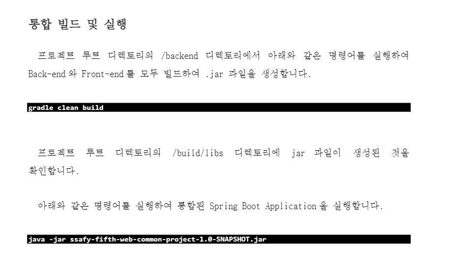

# [210712] 설치 및 환경설정

## 1. 형상 관리

- git 설치: https://git-scm.com/downloads
- SourceTree 설치
  - https://git-scm.com/downloads/guis 를 통해 SourceTree 페이지로 이동
  - https://www.sourcetreeapp.com/ 에서 SourceTree를 다운로드, 설치
  - 현재 연결할 repository가 없으므로, 로그인 및 연결은 생략

## 2. BE

- Java 1.8 설치
  - https://github.com/ojdkbuild/ojdkbuild
  - 1.8.0과 11.0 중, 1.8을 선택하여 다운로드, 설치
- MySQL 5.7 설치
  - https://downloads.mysql.com/archives/installer/
  - Product Version은 5.7.x, Installer는 community를 선택, 다운로드.
  - 최초 과정에서 command 창이 열린 후 바로 닫히는 문제 발생. MySQL Command Line Client도 동작하지 않음.
    - Server Only로 우선 설치한 후, Installer에서 Workbench 등 추가 설치
      - Server Only를 시도한 이유: https://webobj.tistory.com/48 를 참고하며 재설치하였음
    - root 계정 비밀번호를 설정하고, DB 초기 설정
- Eclipse 2020-06 - IDE for Java Developers 설치
  - Help -> Eclipse Marketplace -> sts -> Spring Tools 3 설치
  - 한글 깨짐 방지: 기본값 CP949를 UTF-8로 교체
    - Window - Preference - General - Content Types - Text - Default Encoding: **UTF-8**
    - General - Workspace - Text file encoding - **UTF-8**
    - General - Editors - Text Editors - Spelling - Encoding - **UTF-8**
- IntelliJ 설치
  - https://www.jetbrains.com/ko-kr/idea/download/#section=windows
  - Community 버전 설치
- Lombok 설치
  - https://projectlombok.org/download
  - 다운로드 후 설치; 이 때, 이클립스가 설치된 폴더에서 eclipse.exe를 선택하여 추가, install/update




```
.\gradlew clean build

cd build/libs
java -jar ssafy-fifth-web-common-project-1.0-SNAPSHOT.jar 
```


## 3. FE

- Node.JS 14.17.0 LTS 설치
  - https://nodejs.org/ko/download/releases/ 에서 원하는 버전 찾기
  - https://nodejs.org/download/release/v14.7.0/ 에서 x86용 msi 다운로드, 설치
- VS Code 설치
  - https://code.visualstudio.com/
  - Extensions
    - ESLint
    - EditorConfig for VS Code
    - Vetur
    - vue
    - vscode-icons
    - Vue VSCode Snippets
    - Prettier
