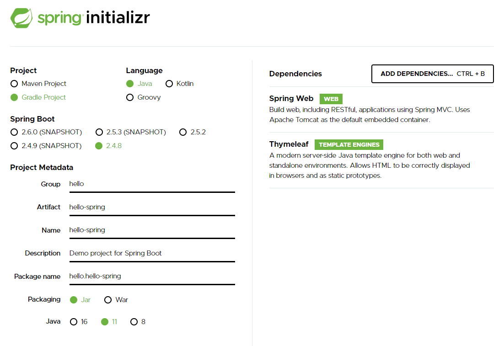

# [210713]

# Spring 학습

> Spring 학습의 길잡이

- 스프링 프로젝트 생성
- 스프링 부트로 웹 서버 실행
- 회원 도메인 개발
- 웹 MVC 개발
- DB 연동 - JDBC, JPA, 스프링 데이터 JPA
- 테스트 케이스 작성


## 1. 프로젝트 환경설정

### 1.1. 프로젝트 생성

- Java 11 설치
- IDE : IntelliJ
- https://start.spring.io/ Spring생성



- IntelliJ에서 build.gradle - Open as project
- 디렉토리 구조 설명
  - main / test : 테스트가 중요하다
  - gradle : 설정 및 라이브러리 가져옴
- srdc - main - java - ... - helloSpringApplication
  - run main
  - localhost:8080 서버 확인


- 설정 - gradle - build and run - IntelliJ IDEA 바꾸기


### 1.2. 라이브러리 살펴보기

> Gradle은 의존관계가 있는 라이브러리를 함께 다운로드 한다.

**스프링 부트 라이브러리**

- spring-boot-starter-web
  - spring-boot-starter-tomcat: 톰캣 (웹서버)
  - spring-webmvc: 스프링 웹 MVC
- spring-boot-starter-thymeleaf: 타임리프 템플릿 엔진(View)
- spring-boot-starter(공통): 스프링 부트 + 스프링 코어 + 로깅
  - spring-boot
    - spring-core
  - spring-boot-starter-logging
    - logback, slf4j

**테스트 라이브러리**

- spring-boot-starter-test
  - junit: 테스트 프레임워크
  - mockito: 목 라이브러리
  - assertj: 테스트 코드를 좀 더 편하게 작성하게 도와주는 라이브러리
  - spring-test: 스프링 통합 테스트 지원


### 1.3. View 환경설정

**정적파일**

resources/static/index.html

```html
<!DOCTYPE html>
<html lang="en">
<head>
    <meta charset="UTF-8">
    <title>Title</title>
</head>
<body>
Hello
</body>
</html>
```

**템플릿엔진**

```java
// hello/hellospring/controller/HelloController.java

package hello.hellospring.controller;

import org.springframework.stereotype.Controller;
import org.springframework.ui.Model;
import org.springframework.web.bind.annotation.GetMapping;

@Controller
public class HelloController {

    @GetMapping("hello")
    public String hello(Model model) {
        model.addAttribute( "data", "hello!!");
        return "hello";
    }
}

```

```html
// resources/templates/hello.html
<!DOCTYPE html>
<html xmlns:th="http://wwww.thymeleaf.org">
<head>
    <meta charset="UTF-8">
    <title>Title</title>
</head>
<body>
<p th:text="'안녕하세요. ' + ${data}"> 안녕하세요. 손님 </p>
</body>
</html>
```


### 1.4. 빌드하고 실행하기

- 콘솔로 이동 명령 프롬프트(cmd)로 이동
- ./gradlew gradlew.bat 를 실행하면 됩니다.
- 명령 프롬프트에서 gradlew.bat 를 실행하려면 gradlew 하고 엔터를 치면 됩니다.
- gradlew build
- 폴더 목록 확인 ls dir
- 윈도우에서 Git bash 터미널 사용하기
  - 링크: https://www.inflearn.com/questions/53961


## 2. 스프링 웹 개발 기초

### 2.1. 정적 컨텐츠


### 2.2. MVC와 템플릿 엔진


### 2.3. API