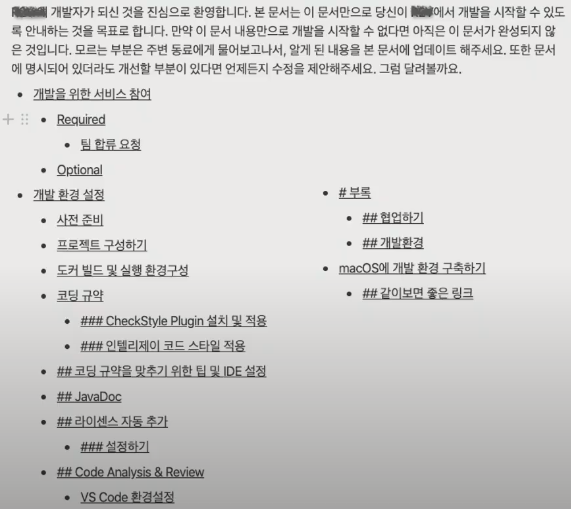

# 개발 프로젝트 협업 툴

> 2021.07.13.

"99%의 사람들은 같은 질문을 생각하니까, 나만 모르는 질문이라고 생각하지 말고 질문하길 주저하지 마세요"

- 현업과 유사성

- [주니어 개발자를 위한 취업 정보](https://github.com/jojoldu/junior-recruit-scheduler)
- 하나를 깊게 알면 비슷한 도구도 쉽게 적응 가능
- 개발자의 코딩 실력 + 협업도구를 다루는 실력 밸런스
- 잘 갖춰진 도구들 통합
- 원격 협업에서 특히 도구를 활용한 적극적인 커뮤니케이션 노력 필요

## 1. Developer Onboarding

- 개발환경 맞추기

## 2. IDE

## 3. VCS - 코드 관리

## 4. ISSUES - 이슈/프로젝트 관리

- webhook

  한 시스템에서 발생하는 이벤트를 다른 시스템에 받아서 처리(이벤트 핸들러)할 필요가 있을 때 사용하며 reverse API, Web Callback, HTTP push API라고도 불리는 시스템 연동에 사용되는 기술

## 5. DOCS - 공유문서 관리

## 6. CHAT - 커뮤니케이션

