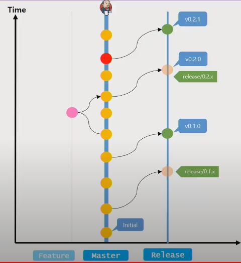
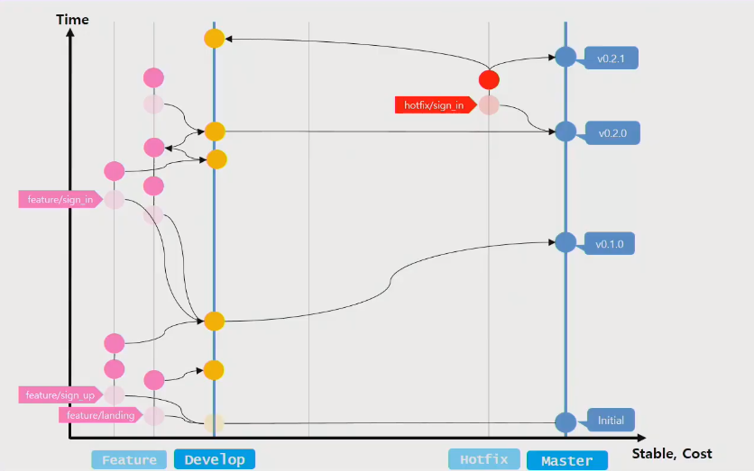
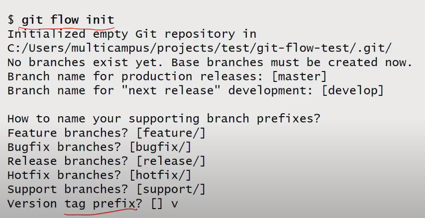
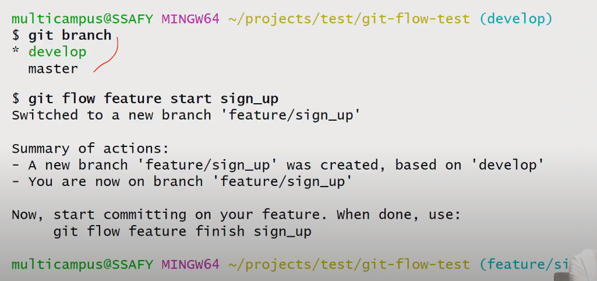
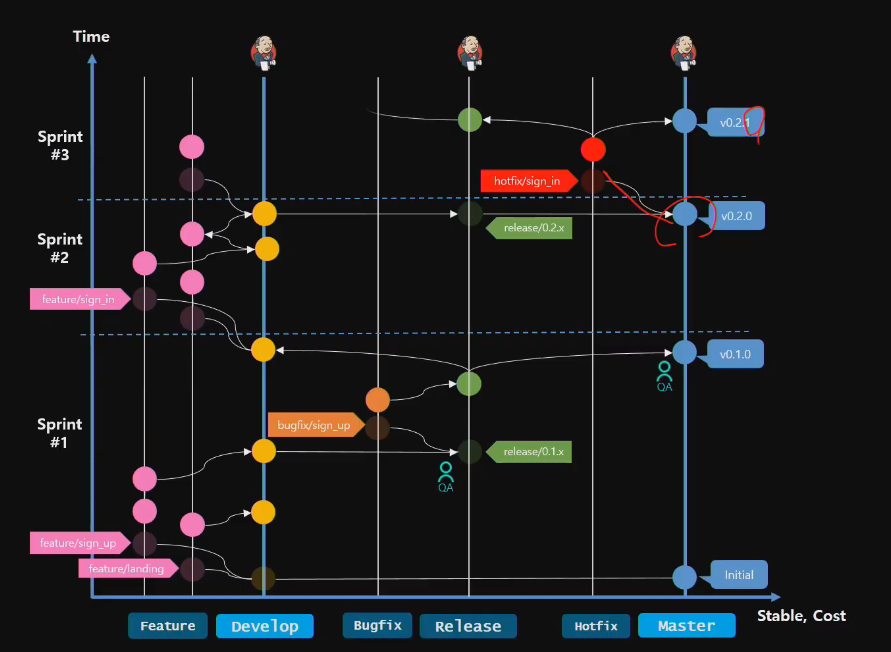
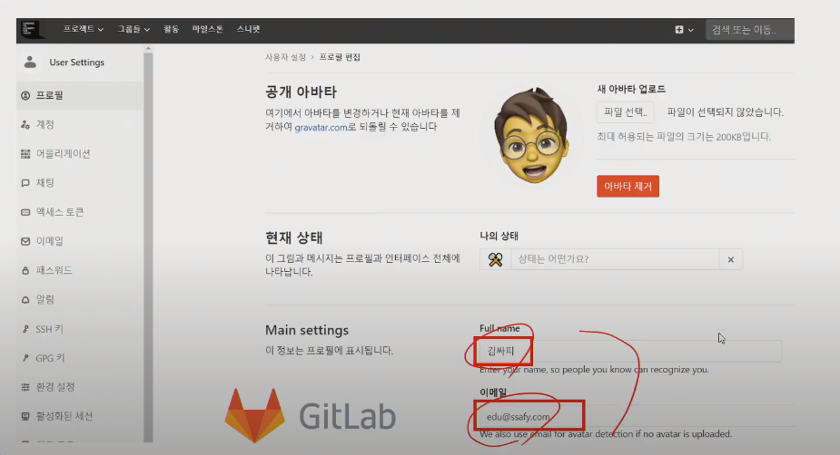
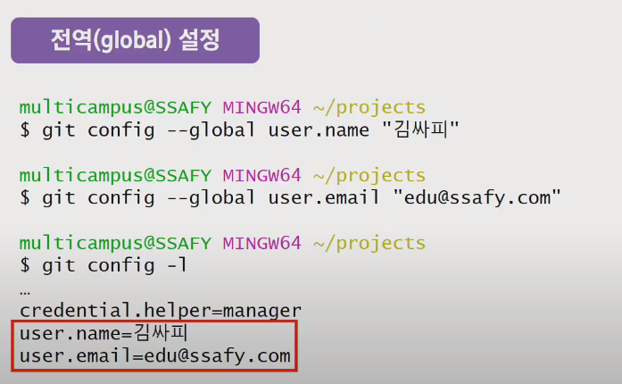
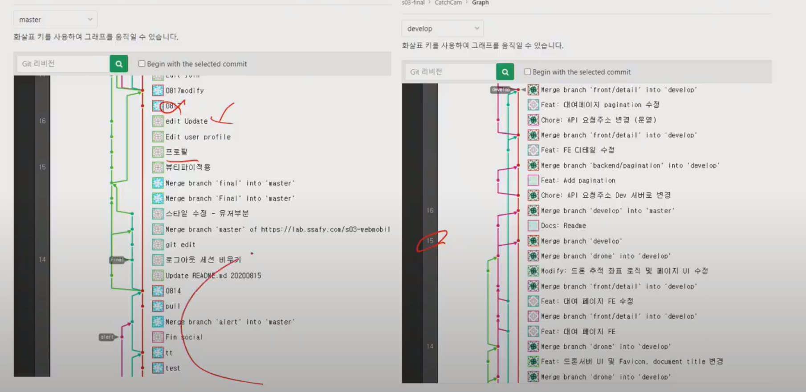

# [210714]

> - Git 기본 개념/명령어 숙지
> - Git Branch 전략 및 Work Flow를 통해 효과적인 팀개발을 진행하자
> - [Lean Git Branching](https://learngitbranching.js.org/?locale=ko) 에서 연습하자

## 1. Git Flow

### 1.1. Git 개요

**개인 플레이**

- 코드 관리/백업

**멀티 플레이**

- 협업 Workflow
- 서비스/제품 이력관리
- 커밋 규칙과 정확한 메시지
- 코드 리뷰

### 1.2. Git Branch

- Git의 핵심은 Commit

- Git branch를 잘 활용하자

### 1.3. Git Branch 전략

- Master
- Release
- Develop
- Feature
- Hotfix
- Bugfix

#### 1.3.1. Trunk Based

- 최대한 가볍게 작업을 하자
- 코드 리뷰없이 Senior 레벨에서 사용할만함

#### 1.3.2. Git Flow

- Master
- Develop
- Hotfix
- Feature

## 2. Git Workflow

### 2.1. Git 사용시 주의점

- Sprint 별로 Release 하면서 -> Master 버젼을 업데이트합니다.

#### 2.1.1. Git commit 사전 작업

##### 1) 환경 설정

- GitLab 설정과 Local 설정을 맞추어야 합니다.

##### 2) 정확한 커밋 만들기

- 아이디 맞추기

##### 3) 커밋 메세지

- 날짜 사용 x

- 컨벤션에 맞는 커밋 메세지 사용

  

##### 4) Gitignore

- 키 값
- node modules 
- 로그, 백업 파일

### 2.2. Git Wrap up

### 2.3. Quiz & Show

