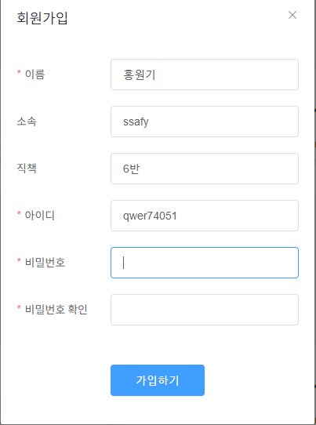

# 공통PJT_SUB1소감

## 1. 결과 화면

### 1️⃣ 비로그인

### 2️⃣ 회원가입

#### 1.2.1. 입력란

#### 1.2.2. 유효성 검사

#### 1.2.3. 회원가입 성공확인

### 3️⃣ 로그인

#### 1.3.1. 입력란 & 유효성 검사

#### 1.3.2. 로그인 성공확인

- 토큰 발급 & localStorage 저장

### 

#### 1.3.3. 로그인 화면

### 4️⃣ 로그아웃

#### 1.4.1. 로그아웃 버튼

#### 1.4.2. 로그아웃 확인

## 2. JIRA 관리

### 2.1. 인증 및 토큰 관리

- [x] 로그인 시 토큰 확인
- [x] 토큰 저장
- [x] 유저 정보 Get
- [x] 로그아웃

### 2.2. 로딩 스피너

- [ ] 홈 - 방 목록 조회
- [ ] 홈 - 방 목록 조회 - 방 상세 정보
- [ ] 지난 회의 이력
- [ ] 로그인 클릭

### 2.3. 메뉴

- [x] 로그인 화면
- [x] 비로그인 화면

### 2.4. 회원가입 및 로그인 버튼

- [x] 로그인
- [x] 회원가입

### 2.5. 회원가입

- [x] 비로그인 상태에서 회원가입 버튼 보이기
- [x] 입력 정보 추가
- [x] 유효성 체크
  - [ ] 아이디 중복확인
  - [ ] 비밀번호 확인

### 2.6. 로그인

- [x] 비로그인 상태에서 로그인 버튼 보이기

- [x] 로그인 팝업

  

### 

## 3. 소감

- 새로운 팀원분들과 호흡을 맞출 수 있는 좋은 기회였습니다.

- 또한 새로운 Spring  프레임 워크를 도입해보고, 학습의 기회로 삼았습니다.

- 최신의 Vue3를 사용함으로써 FE 트렌드에 발맞추었습니다.

- 로그인 및 회원가입 통신에 대해 다시금 복습하는 계기가 되었습니다.

- 토큰 기반 인증에 대한 이해를 높였습니다.

- 인증 및  보안에 대한 신경을 써야함도 느꼈습니다.

- 명세대로 구현하기에도 시간이 촉박하는,,, ㅎㅎㅎ

- JS와 Vue.js를 더 열심히 공부해야겠다는 반성과 다짐의 계기가 되었습니다.

- Spring을 모른다고 손을 떼느니, 모르는 부분을 솔직하게 말하는 것에 대한 중요성을 배웠습니다.

- JIRA에 대한 이해

- Git 활용에서 기능을 완료하면 Commit을 자주 남겨야겠다는 생각을 하게 되었습니다.

- 매일 꾸준히 JIRA, GitLab, README 관리가 필요하다는 것을 느꼈습니다.

  