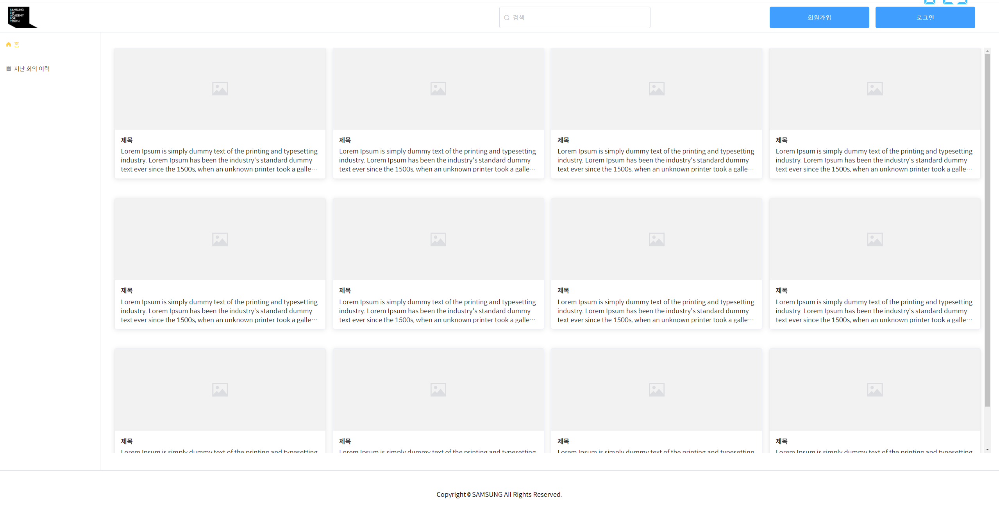
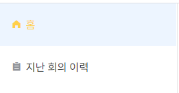

# 코드 해체 분석기

## 1. 명세서

> Keywords: `Vu3`, `Element UI Plus`, `Vuex`

### 1.1. Vue 3

- 인스턴스 생성 방식 변화
- Template 선언
- Composition API : setup()
- Composition API : (on) lifecyclehook
- Composition API : props & emit

### 1.2. 폴더 구조


### 1.3. 요구사항 명세서 

- 로그인


## 2. Source Code

로그인에 대한 소스 코드 분석

### 2.1. Main


- main 디렉토리 구조
  - components
    - login
    - footer
    - header
    - sidebar
  - store `(= vuex)`
    - actions
    - getters
    - index
    - mutations
    - state
  - main.css
  - main.vue
  - menu.json


### 2.2. main - components



- components 
  - login

  - ~~footer - 하단~~

    

  - header

  - ~~sidebar - 옆~~

    


## 3. Component

### 3.1. main.vue

> 메인에서는 로그인 및 회원가입에서 올라온 이벤트를 받아주고, Dialog의 상태를 내려줍니다.

```vue
<template>
  <el-container class="main-wrapper">
    <main-header
      :height="`70px`"
      @openLoginDialog="onOpenLoginDialog"
      @openSigninDialog="onOpenSigninDialog"
      />
    <el-container class="main-container">
      <el-aside class="hide-on-small" width="240px">
        <main-sidebar
          :width="`240px`"/>
      </el-aside>
      <el-main>
        <router-view></router-view>
      </el-main>
    </el-container>
    <main-footer :height="`110px`"/>
  </el-container>
  <login-dialog
    :open="loginDialogOpen"
    @closeLoginDialog="onCloseLoginDialog"/>
  <signin-dialog
    :open="signinDialogOpen"
    @closeSigninDialog="onCloseSigninDialog"/>
</template>
<style>
  @import "https://unpkg.com/element-plus/lib/theme-chalk/index.css";
  @import './main.css';
  @import '../../common/css/common.css';
  @import '../../common/css/element-plus.css';

</style>
<script>
import LoginDialog from './components/login-dialog'
import SigninDialog from './components/signin-dialog'
import MainHeader from './components/main-header'
import MainSidebar from './components/main-sidebar'
import MainFooter from './components/main-footer'
import { useRouter } from 'vue-router'
import { useStore } from 'vuex'

export default {
  name: 'Main',
  components: {
    MainHeader,
    MainSidebar,
    MainFooter,
    LoginDialog,
    SigninDialog
  },
  data () {
    return {
      loginDialogOpen: false,
      signinDialogOpen: false,
    }
  },
  methods: {
    onOpenLoginDialog () {
      this.loginDialogOpen = true
    },
    onCloseLoginDialog () {
      this.loginDialogOpen = false
    },
    onOpenSigninDialog () {
      this.signinDialogOpen = true
    },
    onCloseSigninDialog () {
      this.signinDialogOpen = false
    },
    setToken: function () {
      const token = localStorage.getItem('jwt')
      const config = {
        Authorization: `Bearer ${token}`
      }
      return config
    },
  },
  computed: {
    userId: function () {
      const store = useStore()
      return store.getters['root/getUserId']
    }
  }
}

</script>

```

### 3.2. main-header

> 헤더 로고, 검색, 로그인, 회원가입 이벤트를 보내어 Dialog를 꺼냅니다.

```vue
<template>
  <!-- Notice. 해설은 해당코드 위에 적어두었습니다. -->
  <!-- https://atom.io/packages/element-ui-snippets
  1) el-row는 Vue Element-UI Snippets으로 그리드를 잡아줍니다.
  2) gutter 또한 css grid layout에 사용되는 파라미터 입니다. A gutter is the clear empty space between an element’s boundaries and the element’s content.
  -->
  <el-row
    class="main-header"
    :gutter="10"
    :style="{ 'height': height }">
    <!-- 3) 하단에 hide-on-small과 hide-on-big 클래스가 보입니다. 이는 화면 크기에 따라 보여지는 UI가 달라지게 됩니다. -->
    <!-- 4) 큰 화면에서의 UI입니다. -->
    <div class="hide-on-small">
      <!-- 4-1) 로고를 누르면 홈화면으로 돌아옵니다.-->
      <div class="logo-wrapper" @click="clickLogo"><div class="ic ic-logo"/></div>
      <div class="tool-wrapper">
        <!-- 4-2) 검색 바입니다. -->
        <div class="search-field">
          <el-input
            placeholder="검색"
            prefix-icon="el-icon-search"
            v-model="state.searchValue">
          </el-input>
        </div>
        <!-- 4-3) 회원가입 및 로그인 버튼입니다. -->
        <div class="button-wrapper">
          <div v-if="userInfo.userId">
            <!-- 오른쪽 정렬 하고 싶습니다..-->
            <span style="margin-right: 5px;">
            안녕하세요, {{ userInfo.userId }}님
            </span>
            <el-button type="primary" @click="clickLogout">로그아웃</el-button>
          </div>
          <div v-else>
            <el-button @click="clickSignin">회원가입</el-button>
            <el-button type="primary" @click="clickLogin">로그인</el-button>
          </div>
        </div>
      </div>

    </div>
    <!-- 5) 작은 화면에서의 UI입니다. -->
    <div class="hide-on-big">
      <!-- 5-1) 메뉴 아이콘을 눌렀을 시 왼쪽 메뉴바가 보입니다. -->
      <div class="menu-icon-wrapper" @click="changeCollapse"><i class="el-icon-menu"></i></div>
      <div class="logo-wrapper" @click="clickLogo"><div class="ic ic-logo"/></div>
      <div class="menu-icon-wrapper"><i class="el-icon-search"></i></div>
      <!-- 5-2) 왼쪽 메뉴바의 상태를 바꿔주는 코드가 인상적이네요 ;ㅅ;
      const state 로 정의된 변수안에 isCollapse 라는 속성값을 !(반대로) 바꿔줍니다.
      -->
      <div class="mobile-sidebar-wrapper" v-if="!state.isCollapse">
        <div class="mobile-sidebar">
          <div class="mobile-sidebar-tool-wrapper">
            <!-- 5-3) 로고를 누르면 홈화면으로 돌아오는 듯 보였으나, 기능이 없는 이미지였네요.
              problem : 동작하지 않았습니다.
              solving : @click="clickLogo" 추가 -->
            <div class="logo-wrapper"><div class="ic ic-logo" @click="clickLogo"/></div>
            <!-- 5-4) 회원가입 및 로그인 버튼입니다. -->
            <!-- <div v-if="userInfo.userId">
              <el-button type="primary" class="mobile-sidebar-btn login-btn" @click="clickLogout">로그아웃</el-button>
            </div> -->
            <!-- <div v-else> -->
            <el-button type="primary" class="mobile-sidebar-btn login-btn" @click="clickLogin">로그인</el-button>
            <el-button class="mobile-sidebar-btn register-btn" @click="clickSignin">회원가입</el-button>
            <!-- </div> -->
          </div>
          <!-- 5-5) https://atom.io/packages/element-ui-snippets#menu
          el-menu는 Vue Element-UI Snippets으로 메뉴를 보여줍니다.
            default-active는 activeIndex를 불러오고
              activeIndex는 getters(vuex)에서 Active된 메뉴 인덱스 가져옵니다.
            active-text-color 현재 선택된(Active) 메뉴에 색상을 입힙니다.
            menuSelect을 통해서 선택된 메뉴로 이동합니다.
          -->
          <el-menu
            :default-active="String(state.activeIndex)"
            active-text-color="#ffd04b"
            class="el-menu-vertical-demo"
            @select="menuSelect">
            <!-- 5-6) state 안의 menuItems을 하나씩 꺼내줍니다.
            menuItems은 getters에서 getMenus 함수를 통해 메뉴 객체를 가져옵니다.
              getMeneus는 menu.json에서 데이터를 가져옵니다.
              menuItems에서 아이콘과 이름을 가져와서 menuArray에 담습니다.
            key로는 index를, index로는 string형태의 index으로 하나봅니다..?
             -->
            <el-menu-item v-for="(item, index) in state.menuItems" :key="index" :index="index.toString()">
              <!-- 5-7) 만약 아이콘이 있다면 ic를 붙여줍니다.
                <i class="ic el-icon-s-home"></i>
              -->
              <i v-if="item.icon" :class="['ic', item.icon]"/>
              <span>{{ item.title }}</span>
            </el-menu-item>
          </el-menu>
        </div>
        <!-- 5-8) 메뉴바 밖을 클릭했을 시 state.isCollapse의 상태를 바꿔줍니다.(* 5-2 참고)-->
        <div class="mobile-sidebar-backdrop" @click="changeCollapse"></div>
      </div>
    </div>
  </el-row>
</template>


<script>
import { reactive, computed } from 'vue'
import { useStore } from 'vuex'
import { useRouter } from 'vue-router'

export default {
  // 1) vue 컴포넌트 이름입니다.
  name: 'main-header',

  // 2) props를 통해 height 변수를 받았습니다.
  // main.vue에서 :height="`70px`" 보냈네요.
  props: {
    height: {
      type: String,
      default: '70px'
    }
  },
  // 3) setup을 사용해볼까요?
  // data와 methods가 정의되어 있습니다.
  // props와 emit을 정의하고 있습니다.
  setup(props, { emit }) {
    // 위에서 import useStore와 useRouter 했네요
    const store = useStore()
    const router = useRouter()

    const userInfo = reactive({
      userId: computed(() => store.getters['root/getUserId'])
    })

    // https://v3.ko.vuejs.org/guide/reactivity.html
    // reactive := 변경 제어
    // 추가 개념 Proxy => Reflect, track, trigger
    // state에는 4개 searchValue, isCollapse, menuItems => menuArray, activeIndex
    const state = reactive({
      searchValue: null,
      isCollapse: true,
      menuItems: computed(() => {
        const MenuItems = store.getters['root/getMenus']
        let keys = Object.keys(MenuItems)
        let menuArray = []
        for (let i = 0; i < keys.length; ++i) {
          let menuObject = {}
          menuObject.icon = MenuItems[keys[i]].icon
          menuObject.title = MenuItems[keys[i]].name
          menuArray.push(menuObject)
        }
        return menuArray
      }),
      activeIndex: computed(() => store.getters['root/getActiveMenuIndex'])
    })
    // getters에서 getActiveMenuIndex 함수에 findIndex가 있습니다.
    // return keys.findIndex(item => item === state.activeMenu)
    // 지금 vue.js devtools가 실행되지 않아 확인하지는 못했지만
    // 아마 item === state.activeMenu에 부합하지 않은 조건은 -1으로 반환하나 봅니다.
    // 따라서 activeIndex 값이 -1인 메뉴는 activeIndex 0으로 바꿔줍니다.
    if (state.activeIndex === -1) {
      state.activeIndex = 0
      store.commit('root/setMenuActive', 0)
    }

    // 선택한 메뉴로 라우팅 해주는 함수입니다.
    // 🤦‍♂️아직은 온전히 이해되지 않은 듯 합니다..
    // --param의 활용--
    // 아래의 clickLogo 함수와 엮어서 이해하면 좋습니다.
    // clickLogo의 경우 Home 으로 라우팅해주는데, index=0으로 밀어주나 봅니다.
    // 마찬가지로 menuSelect에서 param이 index를 의미하며, index는 위 template에서 v-for에서 받아왔습니다.
    // Home은 0, History는 1입니다.
    const menuSelect = function (param) {
      store.commit('root/setMenuActive', param)
      // console.log(param)
      const MenuItems = store.getters['root/getMenus']
      let keys = Object.keys(MenuItems)
      router.push({
        name: keys[param]
      })
    }
    const clickLogo = () => {
      store.commit('root/setMenuActive', 0)
      const MenuItems = store.getters['root/getMenus']
      let keys = Object.keys(MenuItems)
      router.push({
        name: keys[0]
      })
    }
    // 로그인 버튼을 누르면, emit으로 이벤트를 부모로 올려보냅니다.
    // main.vue에서 확인해봅시다!
    const clickLogin = () => {
      emit('openLoginDialog')
    }
    // 회원가입 버튼도 만들어 봅시다.
    const clickSignin = () => {
      console.log('click signin!!')
      emit('openSigninDialog')
    }
    // 로그아웃 버튼을 누릅니다.
    const clickLogout = () => {
      console.log('logout')
      localStorage.removeItem('jwt')
      location.reload()
    }
    // state 안의 isCollapse의 상태를 바꾸어줍니다.
    const changeCollapse = () => {
      state.isCollapse = !state.isCollapse
    }
    // 현재까지 정의한 것을 return 합니다.
    // 변수 : state, userInfo
    // 함수 : menuSelect, clickLogo, clickLogin, clickSignin, changeCollapse
    return { state, userInfo, menuSelect, clickLogo, clickLogin, clickSignin, clickLogout, changeCollapse }
  },
}
</script>
```

### 3.3. login-dialog

> 로그인 이벤트를 보냅니다.

```vue
<template>
  <!-- 로그인 dialog를 띄웁니다.
   state.dialogVisible는 props.open으로 props를 받아왔습니다.
   handleClose은 emit 으로 이벤트를 main으로 올립니다.
  -->
  <el-dialog
    custom-class="login-dialog"
    title="로그인"
    v-model="state.dialogVisible"
    @close="handleClose"
  >
  <!-- https://atom.io/packages/element-ui-snippets#menu
    :model 과 :rules 을 연결합니다.
    👀 ref="loginForm"  => const loginForm = ref(null) 이라는데, 왜 사용하는지 모르겠습니다.
    라벨을 왼쪽 정렬합니다.
    -->
    <el-form :model="state.form" :rules="state.rules" ref="loginForm" :label-position="state.form.align">
      <!-- form에서 받은 속성들을 prop으로 받아줍니다. -->
      <el-form-item prop="id" label="아이디" :label-width="state.formLabelWidth">
        <el-input v-model="state.form.id" autocomplete="off"></el-input>
      </el-form-item>
      <el-form-item prop="password" label="비밀번호" :label-width="state.formLabelWidth">
        <el-input v-model="state.form.password" autocomplete="off" @keyup.enter="clickLogin" show-password></el-input>
      </el-form-item>
    </el-form>
    <!-- dialog의 하단 부분입니다. -->
    <template #footer>
      <span class="dialog-footer">
        <el-button type="primary" @click="clickLogin" @keyup.enter="clickLogin" :disabled="!state.isValid">로그인</el-button>
      </span>
    </template>
  </el-dialog>
</template>
<style>
.login-dialog {
  width: 400px !important;
  height: 300px;
}
.login-dialog .el-dialog__headerbtn {
  float: right;
}
.login-dialog .el-form-item__content {
  margin-left: 0 !important;
  float: right;
  width: 200px;
  display: inline-block;
}
.login-dialog .el-form-item {
  margin-bottom: 20px;
}
.login-dialog .el-form-item__error {
  font-size: 12px;
  color: red;
}
.login-dialog .el-input__suffix {
  display: none;
}
.login-dialog .el-dialog__footer {
  margin: 0 calc(50% - 80px);
  padding-top: 0;
  display: inline-block;
}
.login-dialog .dialog-footer .el-button {
  width: 120px;
}
</style>

<script>
import { reactive, computed, ref, onMounted } from 'vue'
import { useStore } from 'vuex'

export default {
  name: 'login-dialog',

  props: {
    open: {
      type: Boolean,
      default: false
    }
  },

  setup(props, { emit }) {
    const store = useStore()
    // 마운드 이후 바인딩 될 예정 - 컨텍스트에 노출시켜야함. <return>
    const loginForm = ref(null)

    /*
      // Element UI Validator
      // rules의 객체 키 값과 form의 객체 키 값이 같아야 매칭되어 적용됨
      //
    */
    const state = reactive({
      form: {
        id: '',
        password: '',
        align: 'left'
      },
      rules: {
        id: [
          { required: true, message: 'Please input ID', trigger: 'blur' },
          { max: 16, message: '최대 16자까지 입력 가능합니다.', trigger: 'blur' },
        ],
        password: [
          { required: true, message: 'Please input password', trigger: 'blur' },
          { min: 9, message: '최소 9자까지 입력 가능합니다.', trigger: 'blur' },
          { max: 16, message: '최대 16자까지 입력 가능합니다.', trigger: 'blur' },
          { pattern: /^(?=.*[A-Za-z])(?=.*\d)(?=.*[$@$!%*#?&])[A-Za-z\d$@$!%*#?&]{0,}$/ , message: '최대 16자까지 입력 가능합니다.', trigger: 'blur' },
        ]
      },
      dialogVisible: computed(() => props.open),
      formLabelWidth: '120px',
      isValid: computed (() => {
        if (loginForm.value == null) return false;
        let flag = false;
        loginForm.value.validate((valid) => {
          flag = valid;
        })
        return flag;
      })

    })

    // loginForm.value를 확인해봅시다.
    onMounted(() => {
      // console.log(loginForm)
      // console.log(loginForm.value)
    })

    // 로그인 클릭 함수입니다.
    const clickLogin = function () {
      // 로그인 클릭 시 validate 체크 후 그 결과 값에 따라, 로그인 API 호출 또는 경고창 표시
      loginForm.value.validate((valid) => {
        // 만약 유효하다면
        if (valid) {
          console.log('submit')
          // 500 error 가 발생합니다.
          // 토큰이 없어서 일까요, 회원정보가 없어서 일까요?
          store.dispatch('root/requestLogin', { user_id: state.form.id, password: state.form.password })
          .then(function (result) {
            alert('accessToken: ' + result.data.accessToken)
            localStorage.setItem('jwt', result.data.accessToken)

            // user id를 state에 저장
            store.commit('root/setUserId', state.form.id)
            const userId = store.getters['root/getUserId']

            handleClose()
          })
          .catch(function (err) {
            console.log('valid pass but catch')
            alert(err)
          })
        } else {
          // 유효하지 않다면
          console.log('Validate error')
          alert('Validate error!')
        }
      });
    }
    // 닫으면 id와 password를 원래대로 복구합니다.
    // emit을 통해 event를 넘겨줍니다.
    const handleClose = function () {
      state.form.id = ''
      state.form.password = ''
      emit('closeLoginDialog')
    }

    return { loginForm, state, clickLogin, handleClose }
  }
}
</script>
```

### 3.4. signin-dialog

> 회원가입 이벤트를 보냅니다.

```vue
<template>
  <!-- 회원가입 dialog를 띄웁니다.
   state.dialogVisible는 props.open으로 props를 받아왔습니다.
   handleClose은 emit 으로 이벤트를 main으로 올립니다.
  -->
  <el-dialog
    custom-class="login-dialog"
    title="회원가입"
    v-model="state.dialogVisible"
    @close="handleClose"
  >
  <!-- https://atom.io/packages/element-ui-snippets#menu
    :model 과 :rules 을 연결합니다.
    👀 ref="loginForm"  => const loginForm = ref(null) 이라는데, 왜 사용하는지 모르겠습니다.
    라벨을 왼쪽 정렬합니다.
    -->
    <el-form :model="state.form" :rules="state.rules" ref="signinForm" :label-position="state.form.align">
      <!-- form에서 받은 속성들을 prop으로 받아줍니다. -->
      <el-form-item prop="name" label="이름" :label-width="state.formLabelWidth">
        <el-input v-model="state.form.name" autocomplete="off"></el-input>
      </el-form-item>
      <el-form-item prop="department" label="소속" :label-width="state.formLabelWidth">
        <el-input v-model="state.form.department" autocomplete="off"></el-input>
      </el-form-item>
      <el-form-item prop="position" label="직책" :label-width="state.formLabelWidth">
        <el-input v-model="state.form.position" autocomplete="off"></el-input>
      </el-form-item>
      <el-form-item prop="user_id" label="아이디" :label-width="state.formLabelWidth">
        <el-input v-model="state.form.user_id" autocomplete="off"></el-input>
        <!-- <el-button type="primary" @click="checkId">중복 확인</el-button> -->
      </el-form-item>
      <el-form-item prop="password" label="비밀번호" :label-width="state.formLabelWidth">
        <el-input v-model="state.form.password" autocomplete="off" show-password></el-input>
      </el-form-item>
      <el-form-item prop="passwordConfirm" label="비밀번호 확인" :label-width="state.formLabelWidth">
        <el-input v-model="state.form.passwordConfirm" autocomplete="off" show-password></el-input>
      </el-form-item>
    </el-form>
    <!-- dialog의 하단 부분입니다. -->
    <template #footer>
      <span class="dialog-footer">
        <el-button type="primary" @click="clickSignin" @keyup.enter="clickSignin">가입하기</el-button>
      </span>
    </template>
  </el-dialog>
</template>
<style>
.login-dialog {
  width: 400px !important;
  height: 550px;
}
.login-dialog .el-dialog__headerbtn {
  float: right;
}
.login-dialog .el-form-item__content {
  margin-left: 0 !important;
  float: right;
  width: 200px;
  display: inline-block;
}
.login-dialog .el-form-item {
  margin-bottom: 20px;
}
.login-dialog .el-form-item__error {
  font-size: 12px;
  color: red;
}
.login-dialog .el-input__suffix {
  display: none;
}
.login-dialog .el-dialog__footer {
  margin: 0 calc(50% - 80px);
  padding-top: 0;
  display: inline-block;
}
.login-dialog .dialog-footer .el-button {
  width: 120px;
}
</style>

<script>
import { reactive, computed, ref, onMounted } from 'vue'
import { useStore } from 'vuex'

export default {
  name: 'signin-dialog',

  props: {
    open: {
      type: Boolean,
      default: false
    }
  },

  setup(props, { emit }) {
    const store = useStore()
    // 마운드 이후 바인딩 될 예정 - 컨텍스트에 노출시켜야함. <return>
    const signinForm = ref(null)

    const state = reactive({
      form: {
        name: '',
        department: '',
        position: '',
        user_id: '',
        password: '',
        passwordConfirm: '',
        align: 'left'
      },
      rules: {
        name: [
          { required: true, message: '필수 입력 항목입니다.', trigger: 'blur' },
          { max: 30, message: '최대 30자까지 입력 가능합니다.', trigger: 'blur' },
        ],
        department: [
          { required: false},
          { max: 30, message: '최대 30자까지 입력 가능합니다.', trigger: 'blur' },
        ],
        position: [
          { required: false},
          { max: 30, message: '최대 30자까지 입력 가능합니다.', trigger: 'blur' },
        ],
        user_id: [
          { required: true, message: '필수 입력 항목입니다.', trigger: 'blur' },
          { max: 16, message: '최대 16자까지 입력 가능합니다.', trigger: 'blur' },
        ],
        password: [
          { required: true, message: '필수 입력 항목입니다.', trigger: 'blur' },
          { min: 9, message: '최소 9자까지 입력 가능합니다.', trigger: 'blur' },
          { max: 16, message: '최대 16자까지 입력 가능합니다.', trigger: 'blur' },
          { pattern: /^(?=.*[A-Za-z])(?=.*\d)(?=.*[$@$!%*#?&])[A-Za-z\d$@$!%*#?&]{0,}$/ , message: '영문, 숫자, 특수문자가 조합되어야 합니다.', trigger: 'blur' },
        ],
        passwordConfirm: [
          { required: true, message: '필수 입력 항목입니다.', trigger: 'blur' },
          { min: 9, message: '최소 9자까지 입력 가능합니다.', trigger: 'blur' },
          { max: 16, message: '최대 16자까지 입력 가능합니다.', trigger: 'blur' },
          { pattern: /^(?=.*[A-Za-z])(?=.*\d)(?=.*[$@$!%*#?&])[A-Za-z\d$@$!%*#?&]{0,}$/ , message: '영문, 숫자, 특수문자가 조합되어야 합니다.', trigger: 'blur' },
          { validator: passwordConfirmValid, trigger: 'blur' },
        ]
      },
      dialogVisible: computed(() => props.open),
      formLabelWidth: '120px',
    })

    // signinForm.value를 확인해봅시다.
    onMounted(() => {
      console.log(signinForm.value)
    })

    // 제대로 동작 x
    var passwordConfirmValid = (rule, value, callback) => {
      if (value !== this.state.form.password) {
        callback(new Error('입력한 비밀번호와 일치하지 않습니다.'));
      } else {
        callback();
      }
    }

    // 아이디 중복 확인 함수입니다.
    const checkId = function () {
      store.dispatch('root/getUserInfo')
      .then(function (result) {
        console.log('')
      })
      console.log('click')
      // axios 부르고 DB에서 아이디 중복 확인한 후
      async
    }


    // 로그인 클릭 함수입니다.
    const clickSignin = function () {
      console.log('click')
      // 로그인 클릭 시 validate 체크 후 그 결과 값에 따라, 로그인 API 호출 또는 경고창 표시
      signinForm.value.validate((valid) => {
        // 만약 유효하다면
        if (valid) {
          // console.log('submit')
          store.dispatch('root/requestSignin', {
            name: state.form.name,
            department: state.form.department,
            position: state.form.position,
            user_id: state.form.user_id,
            password: state.form.password,
            passwordConfirm: state.form.passwordConfirm,
            })
          .then(function (result) {
            console.log('success')
            handleClose()
          })
          .catch(function (err) {
            alert(err)
          })
        } else {
          // 유효하지 않다면
          alert('Validate error!')
        }
      });
    }
    // 닫으면 id와 password를 원래대로 복구합니다.
    // emit을 통해 event를 넘겨줍니다.
    const handleClose = function () {
      state.form.name = ''
      state.form.department = ''
      state.form.position = ''
      state.form.user_id = ''
      state.form.password = ''
      state.form.passwordConfirm = ''
      emit('closeSigninDialog')
    }

    return { signinForm, state, checkId, clickSignin, handleClose }
  }
}
</script>

```

