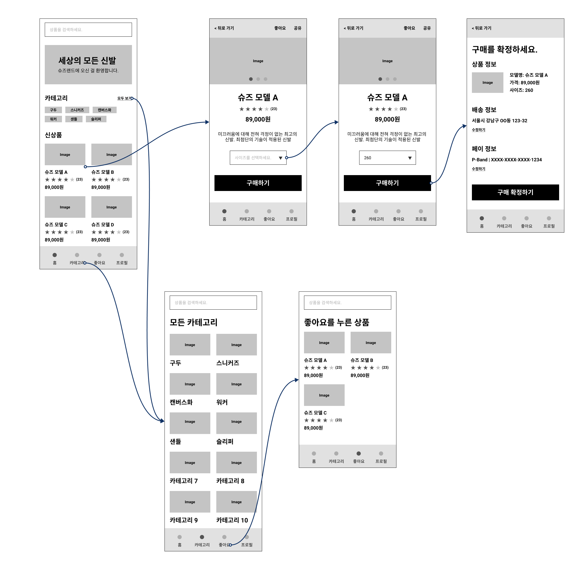

# 업무일지

### ✔ Summary

- [x] 11:00~12:00 [APS] MST & 다익스트라
- [x] 13:00~18:00 [강의] 피그마 강의
- [ ] ~~20:00~22:00 [APS] 힙, 우선순위 큐, 힙큐, 다익스트라(힙큐)~~
- [ ] ~~22:00~01:00	[면접준비]~~
- [x] 21:00-02:00 [강의] 피그마 강의 및 실습

## ✨ 오늘 배운 내용

- [Figma 활용](./figma/피그마기본.md)
  - 스케치
  - 와이어프레임 작업
  - UI 작업
  - 프로토타이핑
  - 디자인 핸드오프

- `UI 디자인 == 시각정보의 계층화 작업`
  
  - 폰트
  - 색상
  
  

## 👀 수행한 업무 및 작성한 코드

## 🐱‍💻 아쉬운 점 & 느낀 점

- Figma : 생각보다 긴 강의시간 + 실습 시간으로 

- 자료구조와 면접준비 미흡

- 다익스트라와 프림에서 우선순위 큐를 활용해보자

  

