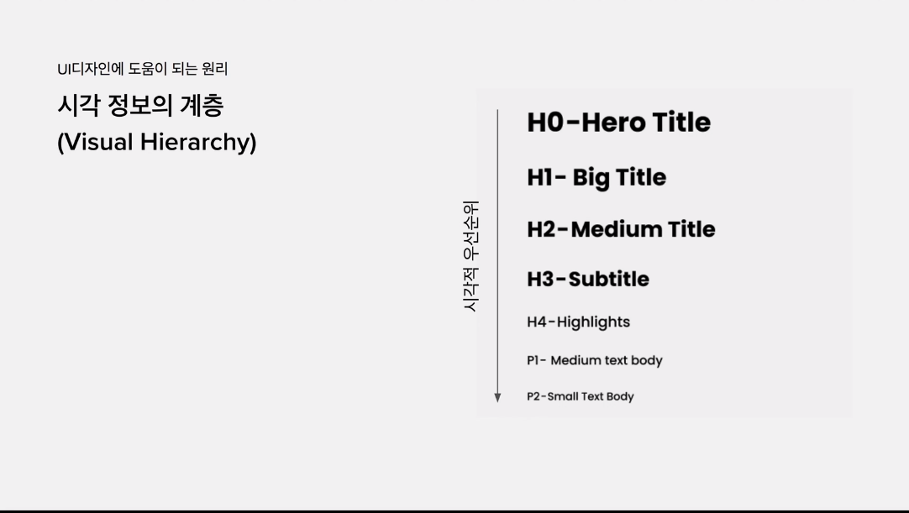
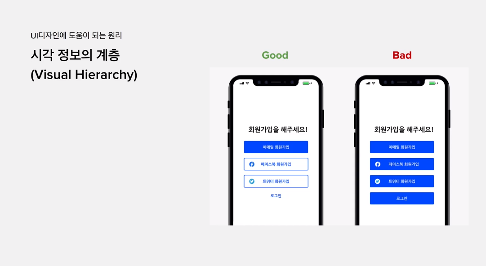

# 피그마를 활용한 UI디자인 입문부터 실전까지 A to Z

## 1. 개요

`Design Thinking` : 공감하기 - 정의학기 - 아이데이션 - 프로토타입 - 테스트 - 출시

`UI 디자인 프로세스` : 스케치 - 와이어프레임 - UI디자인 - 프로토타이핑 - 디자인시스템 - 핸드오프

### 1.1. 어려워 보였던 이유

- 시각적인 감각과 능력
- 아무나 할수 없어 보이는 장벽
- UI 디자인 툴 다루기

### 1.2. 수업의 목표

"누구나 UI디자인 할 수 있다"

- 프로덕트 디자이너, UX/UI 디자이너를 꿈꾸는 입문자
- 피그마를 활용한 UI디자인 실습
- UI디자인의 기본기를 연습

### 1.3. 시각적인 감각과 능력을 기르는 비결

#### 1.3.1. 🚂 UX, UI 디자인의 원칙 및 원리 

> 좋은 UI를 만드는 디자인 원칙이 있다!
>
> - i.g. 변경 전/후, 진행 상태를 명확하게 표현해주는 것

#### 1.3.2. 🚀 좋은 디자인 따라해보기

> 유명한 앱 화면 따라해보면 그 안에 속아져 있는 원리/원칙들을 익힐 수 있다.

#### 1.3.3. 평준화되고 있는 UI디자인

> 디자인 오픈소스, 트랜드를 잘 따라가면 어렵지 않다.

### 1.4. UI 디자인 툴 배우기

1. 훨씬 쉬워지고 편해진 툴
2. 점점 더 진화하고 있는 UI 툴
3. 진입장벽이 낮아지고 있다

## 2. 단계별 핵심 개념

### 2.1. 디자인 씽킹

<<목표설정>> -- <<문제점 도출>> -- <<문제해결>>

`Design Thinking` : 공감하기 - 정의학기 - 아이데이션 - 프로토타입 - 테스트 - 출시

- 프로토타입 : 사용자에게 테스트해보기 위한 제품의 시뮬레이션, 또는 샘플 버전

- 종류
  - 스케치 : Lo-Fi
  - 와이어프레임 : Mid-Fi
  - UI 디자인 : Hi-Fi
  - 프로토타이핑
  - 디자인 핸드오프

### 2.2. 스케치(Lo-Fi)

- 빠른 실행과 커뮤니케이션에 좋은 방법

### 2.3. 와이어프레임 (Mid-Fi)

- 텍스트, 버튼 등 화면에 대한 구성에 대해 정의하고, 화면 간의 플로우를 표현.
- 최종버전인 UI디자인 대비 빠른 수정 및 커뮤니케이션에 좋음

### 2.4. UI 디자인 (Hi-Fi)

- 사용자가 실제로 사용하게 될 높은 퀄리티의 디자인 산출물.
- 색, 폰트 / 폰트 사이즈, 아이콘 등 세부 사항이 적용됨.

### 2.5. 프로토타이핑

- 실제 개발이 된 것은 아니지만, 사용자 테스트 단계에서 
- 사용자의 피드백을 얻거나 내부 커뮤니케이션을 위해 제작

### 2.6. 디자인 핸드오프 (Hand-Off)

- UI 디자인이 완료된 후, 실제품 개발을 위해 개발자에게 전달하는 디자인 산출물

## 🎇 시각계층 - 폰트, 색상

> UI 디자인이란 = 시각정보의 룰을 만들어 주는 것

## 3. Figma

### 3.1. 피그마 기초 기능

#### 3.1.1. 

- 자유 변경
- 비율 고정 사이즈 변경 : Shift
- 비율 고정 & 가운데 중심으로 사이즈 변경 : Shift + Alt

#### 3.1.4. 이동 관련 기능

- 자유 이동
- 1px 단위로 이동 : 키보드 상하좌우 키
- 10px 단위로 이동 : shift + 키보드 상하좌우 키

#### 3.1.5. 간격 확인하기 - 꿀기능

- Alt 누르면서 도형 사이 px 확인

### 3.2. 피그마 기능

#### 3.2.1. 텍스트

#### 3.2.2. 스타일

### 4. 디자인 시스템

> - 일관된 사용자 경험 제공
> - 빠르고 효율적인 디자인
> - 빠르고 효율적인 개발

### 

### 5. UI Component 소개

#### 5.1. Component란

반복적으로 사용되는, 글자 + 색 + 도형으로 구성된 UI 요소

#### 5.2. 대표적인 Component 사례

- Google Material Design
- Human Interface Guideline

#### 5.3. Figma Component 기능을 사용하는 이유

- 반복작업에 대한 효율성 극대화

