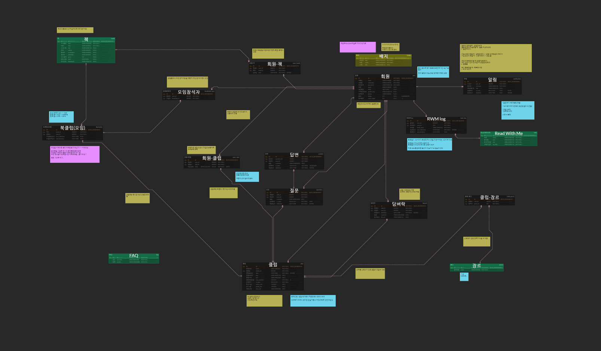
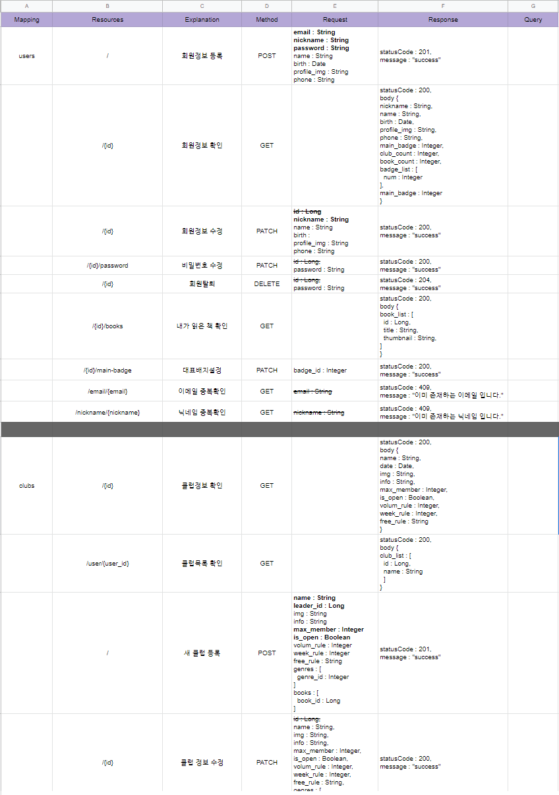
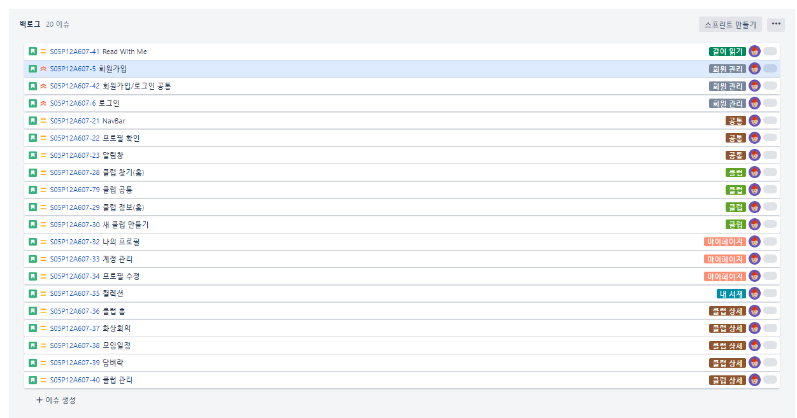

# 업무일지

### ✔ Summary

- [x] 09:00~18:00 PJT
- [x] 18:00~20:00 Dinner
- [x] 20:30~07:00 Sleep...😴😴😴

## ✨ 오늘 배운 내용

- ERD
- RESTful API
- JIRA

## 👀 수행한 업무 및 작성한 코드

## 🐱‍💻 아쉬운 점 & 느낀 점

- 개발에 앞서 설계가 매우 중요하다는 것을 알게 되었다.
- 아이디어를 마음껏 펼쳤더니, 개발에 있어 할일이 엄청 많아짐도 알게 되었다.
- 현재 팀이 가지고 있는 전력을 파악하는 것이 중요하며 이에 따른, 개발 우선순위를 두는 것이 중요하다고 생각됨.
- 또한 골자가 되는 핵심기능이 매력적이지 않다면, 앞으로 벌어질 이 노고들은 아무도 알아주지 않을 것이라는 절망적인 예언을 하나 남긴다.
- 따라서 매력적인 아이디어를 가지고 좋은 설계를 진행하고, 우선순위에 의거한 개발순서를 가져가는 것이 바람직한 프로세스이다.

 

