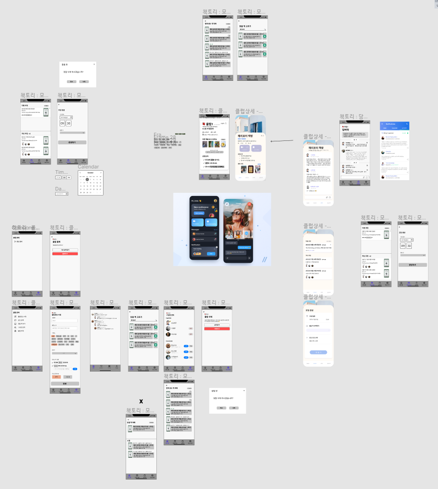

# 업무일지

### ✔ Summary

- [x] 09:00~18:00 Figma UI 작업
- [x] 20:00~22:00 APS - DP
- [x] 23:30~02:00 Figma UI 작업2


## ✨ 오늘 배운 내용

- [개발자의 나쁜 습관](./tips/tips.md)
- Figma UI 작업




## 👀 수행한 업무 및 작성한 코드

```python
"""
dp : 포도주 마시기
단, 연속으로 놓여 있는 3잔을 모두 마실 수는 없다.
i.g.
n = 6
wines = [6, 10, 13, 9, 8, 1]
result
33

*error point
연속해서 포도주를 안 마셔도 상관없다.
n = 10
wines = [0, 0, 10, 0, 5, 10, 0, 0, 1, 10]
result
36
"""
n = int(input())    # 1 <= n <= 100000
wines = [int(input()) for _ in range(n)]
memo = [0] * n

def drinkWine(n):
    if n == 1:
        return wines[0]
    elif n == 2:
        return wines[0] + wines[1]
    elif n == 3:
        memo[2] = max(wines[0] + wines[2], wines[1] + wines[2])
        memo[2] = max(wines[0] + wines[1], memo[2])
        return memo[2]

    memo[0] = wines[0]
    memo[1] = wines[0] + wines[1]
    memo[2] = max(wines[0] + wines[2], wines[1] + wines[2])
    memo[2] = max(memo[1], memo[2])

    for i in range(3, n):
        memo[i] = max(memo[i - 3] + wines[i - 1], memo[i - 2]) + wines[i]
        memo[i] = max(memo[i - 1], memo[i])

    return memo[i]
print(drinkWine(n)) 
```


## 🐱‍💻 아쉬운 점 & 느낀 점

- DP : 포도주 마시기
  - 예외 처리에 대한 이해가 필요합니다.
  - 즐겁게 DP를 활용해 봅시다!

 
