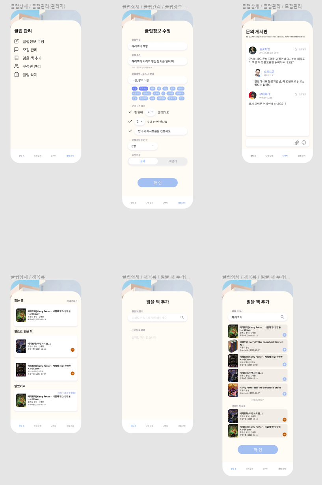

# 업무일지

### ✔ Summary

- [x] 10:00~11:50 UI 작업6
- [x] 13:00~15:00 UI 작업7
- [x] 15:00~15:30 피그마 레이어 정리
- [x] 16:00~18:00 피그마 레이어 정리 2
- [x] 19:30~21:30 피그마 레이어 정리 3


## ✨ 오늘 배운 내용

- 피그마 => 제플린 => CSS 코드
- [개발 관심사 분리](./live/관심사분리.md)




## 👀 수행한 업무 및 작성한 코드

- vuejs로 얼른 작성합시다

```python
# 2193_이친수
# 1 <= n <= 90 자리 수
"""
dp[0] = 1
dp[1] = 1
dp[2] = 2
dp[3] = 3

dp[k] = dp[k - 2] + dp[k - 1]
왜냐하면, k 자리 수에서 -2번째까지 구한 값 + -1번째까지 구한 값


"""


n = int(input())
dp = [0] * (n + 1)

def solution(n):
    if n <= 0: return 0
    if n == 1: return 1
    if dp[n]: 
        return dp[n]
    else:
        dp[n] = solution(n - 1) + solution(n - 2)
        return dp[n]

print(solution(n))
```


## 🐱‍💻 아쉬운 점 & 느낀 점

- dp는 그려서!! 풀어봅시다

 

